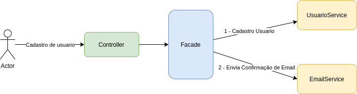

#  Padrão de código Reneg
  
  
##  Java
  
  
O padrão de nome de variaveis e objetos deve seguir o padrão Java feito pela Comunidade hoje.   
  
##  API
  
  
APIs expostas no MBI (externas) deve seguir o modelo **snake_case**    
  
```json
[
    {
        "cpf_cnpj": "35357659869",
        "numero_contrato": "652652616552",
        "codigo_produto": 45685,
        "valor": 999.99
    }
]
```
  
APIs internas deve seguir o modelo **camelCase**    
  
```json
[
    {
        "cpfCnpj": "35357659869",
        "numeroContrato": "652652616552",
        "codigoProduto": 45685,
        "valor": 999.99
    }
]
```
  
##  Arquitetura de Código
  
  
    src/
     |------ main/
     |         |------- java/
     |                    |------- br.com.itau.padraocodigo
     |                                                |------- Application.java
     |                                                |------- config
     |                                                |------- integration
     |                                                |------- contrato
     |                                                             |------- controller
     |                                                             |------- mapper
     |                                                             |------- dominio
     |                                                             |------- facade
     |------ test/
  
#####  Controller
  
  
Controller foi surgido inicialmente no Pattern MVC (Model-View-Controller) com a necessidade de organizar e separar o código Frontend (View) do Backend.
  
#####  Facade
  
  
Facade está ligada diretamente a arquitetura e significa Fachada. Facade é uma camada utilizada para simplicar vários dependências de objetos centralizando as chamadas no mesmo. Um Motivo muito importante do Facade é desacoplar as `Services` fazendo com que elas mantenham uma única responsabilidade.      
  

  
#####  Dominios   
  
  
Separamos os modelos chamados de Dominio (Domain). Um ponto muito importante é seguir o padrão [BoundedContext](https://martinfowler.com/bliki/BoundedContext.html ) (DDD), separando os modelos dentro dos microservices, com o objetivo de fatiar o Serviço facilmente se caso estiver crescendo muito, evitando-o se tornar um monolito.   
  
#####  Mappers
  
  
Aplicações de várias camadas geralmente exigem o mapeamento entre diferentes modelos de objetos (por exemplo, entidades e DTOs). Escrever esse código de mapeamento é uma tarefa tediosa e propensa a erros.     
  
O [MapStruct](https://mapstruct.org/ ) visa simplificar esse trabalho, automatizando-o o máximo possível.
gerando mapeamentos de bean em tempo de compilação (o que o difere do ***Dozer*** que utiliza Refletion e o torna não performático), 
o que garante um alto desempenho, permite feedback rápido do desenvolvedor e verificação completa de erros.   
  
```java
@Mapper
public interface ContratoSaidaMapper {
  
    ContratoSaidaMapper MAPPERS = Mappers.getMapper(ContratoSaidaMapper.class);
  
    ContratoResponse map(BreContratoValidoSaida breContratoValidoSaida);
	List<ContratoResponse> map(List<BreContratoValidoSaida> listBreContratoValidoSaida);
  
}
```
  
```java
@Mapper
public interface BREContratoValidoMapper {
  
  
    BREContratoValidoMapper MAPPERS = Mappers.getMapper(BREContratoValidoMapper.class);
  
    List<BreContratoValidoEntrada> map(List<ContratoAk2Saida> contratosAk3, 
                                       Al0iPDCSaida al0iPDCSaida,
                                       ClienteAv2 clienteAv2, 
                                       List<ContratoAv2> contratosAv2);
  
  
}
```
  
  
#####  Integration
  
  
Dificilmente uma aplicação vai rodar totalmente isolada, contendo outras dependências como outros serviços ou alguma camada de dados, a camada integration representa essas dependêcnias de `Infraestutura`.    
  
##  Trabalhando com Threads
  
  
Para trabalhar com [Concorrência e Paralelismo](https://www.treinaweb.com.br/blog/concorrencia-paralelismo-processos-threads-programacao-sincrona-e-assincrona/ )  em Java utilizamos o RxJava.    
  
##  Dicas 
  
  
Devemos sempre pensar em um código mais Coeso e menos acoplados seguindos os principios de SOLID e Desing Patterns.
  
##  Microservices
  
  
Existem vários padrões para a construção de Microservices, como Descoberta de Serviço, Centralização de Configuração, API Gateway, Banco de Dados segregados e outros. Os [12 fatores](https://12factor.net/pt_br/ ) aborta alguns desses padrões.    
  
Código de Exemplo: https://gitlab.com
  
Ref.:
  